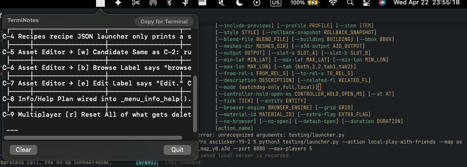
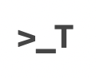

# TermiNotes

<table>
  <tr>
    <td></td>
    <td></td>
  </tr>
</table>

A hyper-lightweight macOS menu bar utility for developers who need to store and sanitize terminal outputs, ASCII diagrams, and multi-line commands without them "breaking."

## Installation

### 1. Build
The easiest way to build is using the provided build script, which creates a proper macOS `.app` bundle:
```bash
chmod +x build.sh
./build.sh
```

### 2. Install (Global Command)
To launch TermiNotes from your terminal and have it **persist** even after you close the terminal window:
```bash
# 1. Create a launcher script (already in project as terminotes_launcher.sh)
mkdir -p ~/bin
cp terminotes_launcher.sh ~/bin/terminotes
chmod +x ~/bin/terminotes
```
*Note: Ensure `~/bin` is in your `$PATH`. This command uses `open` to launch the app bundle, so it stays alive even if the terminal is killed.*

## Why TermiNotes?

Standard note apps often "help" you by converting straight quotes to smart quotes, dashes to em-dashes, and wrapping long lines. This destroys terminal diagrams and breaks code snippets. TermiNotes is built to be a "dumb" raw buffer that preserves everything exactly as it was in the terminal.

## Key Features

- **Menu Bar Resident:** Lives in your top bar (look for the `>_N` icon).
- **Canonical No-Wrap:** ASCII art and terminal graphs (like `git log --graph`) never wrap. They scroll horizontally, preserving their visual structure.
- **Terminal Sanitizer:** Copy text back to the terminal safely with `CMD + Shift + C`. It automatically:
    - Escapes newlines with ` \` for safe multi-line pasting.
    - Converts "smart" quotes and dashes back to ASCII.
    - Trims trailing newlines to prevent accidental command execution.
- **Zoom & Resize:** On-the-fly font scaling (`CMD +/-`) and a custom corner dragger for window expansion.
- **Toggle Lists:** Notion-style collapsing. Select a chunk of lines, right-click → **Toggle List** — the first line becomes the title, the rest folds away. Flip it with `Option-click` on the title, `CMD + \`, or the right-click menu (**Expand/Collapse**, **Remove Toggle**). Folds survive restarts (`toggles.json`).
- **Screenshot Sidebar:** Maccy-style clipboard history for images only. Any screenshot/image you copy (e.g. `Ctrl+CMD+Shift+4`) lands in the sidebar automatically. Click a thumbnail to copy it back, double-click to insert a markdown link at the caret, or drag it out to another app. Toggle the sidebar with the **Shots** button or `CMD + Option + S`.
- **Pure AppKit:** Built with native macOS APIs for near-zero memory footprint and maximum responsiveness.

## Usage

1. **Launch:** Run `terminotes` from your terminal (if aliased) or open the `TermiNotes.app`.
2. **Persistence:** Your notes are automatically saved to `~/Library/Application Support/TermiNotes/notes.txt`.
3. **Shortcuts:**
    - `CMD + V`: Paste (Raw, no-wrap).
    - `CMD + Shift + C`: **Safe Copy** for Terminal (Sanitized for multi-line pasting).
    - `CMD + = / -`: Zoom text.
    - `CMD + \`: Flip the toggle list under the caret.
    - `CMD + Option + S`: Show/hide the screenshot sidebar.
4. **Launch at Login:** Toggle this in the menu to have TermiNotes start automatically when you log in.
